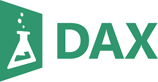

## Hi there 👋
#  I am Vignesh Murugan - Data Scientist/ Data Engineer

## About Me

2+ years of expertise in manipulating data sets, building and deploying statistical models, and delivering data-driven insights to optimize business processes. Proficient in Python, SQL, Power BI, Scikit-Learn, and Azure. Adept at collaborating with cross-functional teams to drive changes and improve business outcomes.

## Languages and Tools

### Languages:
| Python3 | R | JS | DAX | HTML | SQL | 
|----------|----------|----------|----------|----------|----------|
|  |  |   |  |  |  |

### Best frameworks and main libraries for Python3:

| Tensorflow | Keras | Numpy | Pandas | Sklearn | OpenCV | Matplotlib |
|----------|----------|----------|----------|----------|----------|------------|
|   |  | |  |  | | |

### My tools for Data Manipulation & Visualisation:

| Conda | Jupyter | Spark | MySQL | Postgres | Tableau | Power BI |
|----------|-------|---------|-------|-------|----------|---------|
||||||||

### Web, Version Control and Containerization

| Nodejs | Git | Docker | Django |
|----------|----------|----------|----------|
|||||

### OS:

| Linux | Ubuntu |
|----------|----------|
|  |  |

### Cloud Services:

| Azure | Data Factory | Databricks | HDInsight | SQL Server |
|----------|----------|----------|----------|----------|
|  ||||

### Best Libraries for R:

| Library           | Functionality                                                                 |
|-------------------|-------------------------------------------------------------------------------|
| **Tidyverse**      | Comprehensive collection of tools for data manipulation, visualization, and analysis. |
| **caret**          | Machine learning, training, and modeling.                                  |
| **randomForest**   | Random Forest algorithm for classification and regression.                  |
| **e1071**          | Support Vector Machines and other machine learning algorithms.              |
| **MASS**           | Tools and datasets for statistical modeling.                               |
| **arules**         | Association rule mining (e.g., Apriori algorithm).                         |
| **arulesViz**      | Visualization tools for association rules.                                 |
| **cluster**        | Cluster analysis, including methods like PAM.                              |
| **NbClust**        | Determine the optimal number of clusters in clustering algorithms.          |
| **dbscan**         | Density-based clustering.                                                  |
| **lattice**        | Data visualization and graphics.                                           |
| **reshape2**       | Reshape and reorganize data frames.                                        |
| **rpart**          | CART (Classification and Regression Trees) algorithm.                     |
| **party**          | Decision tree modeling and visualization.                                 |
| **partykit**       | Tree-based models and visualizations.                                      |
| **rattle**         | Enhanced tree plots and data mining utilities.                            |
| **wordcloud**      | Generate word clouds from text data.                                       |
| **tm**             | Text mining tools.                                                        |
| **tidytext**       | Tidy tools for text mining.                                               |
| **knitr**          | Dynamic report generation.                                                |
| **VIM**            | Visualization of missing values.                                          |
| **mice**           | Multiple imputation of missing data.                                      |
| **outliers**       | Detect and handle outliers in datasets.                                   |
| **AppliedPredictiveModeling** | Predictive modeling tools.                                      |
| **glmnet**         | Lasso and elastic-net regression.                                         |
| **pls**            | Partial least squares and principal component regression.                 |
| **earth**          | Multivariate adaptive regression splines (MARS).                          |
| **ROCR**           | Performance visualization for classifiers (ROC curves).                  |

---

Feel free to explore my repositories and projects. If you have any questions or would like to collaborate, please reach out to me via [LinkedIn](https://www.linkedin.com/in/vignesh-murugan-791347103/) or murugan.datum@gmail.com
